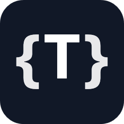
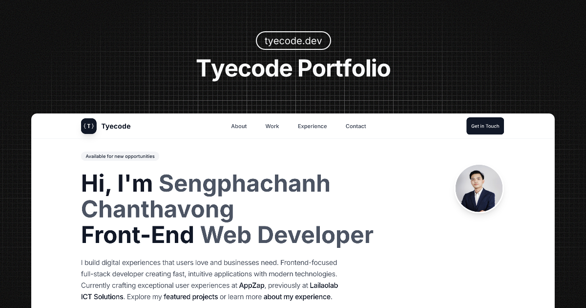

<div align="center">



### tyecode Portfolio

<p align="center">
  <em>Expert Front-End Developer • React & TypeScript Specialist</em>
</p>

---



<br />

</div>

<div align="center">

[](https://reactjs.org/)
[](https://www.typescriptlang.org/)
[](https://tailwindcss.com/)
[](https://vitejs.dev/)

</div>

> **Personal portfolio website - Professional front-end developer specializing in React, TypeScript & modern web technologies.**

## 🚀 Features

- **🎨 Modern Design**: Clean, professional interface with smooth animations
- **📱 Fully Responsive**: Mobile-first approach optimized for all devices
- **⚡ Server-Side Rendering**: React 19 SSR with Express for optimal performance
- **🔍 SEO Optimized**: Comprehensive meta tags and structured data
- **♿ Accessible**: WCAG compliant with semantic HTML
- **🔧 Type Safe**: Built with TypeScript
- **📱 PWA Ready**: Web manifest with app shortcuts and icons
- **🚫 No-JS Fallback**: Complete portfolio experience without JavaScript

## 🛠️ Tech Stack

- **React 19.0** - Latest React with concurrent features
- **TypeScript 5.7** - Type-safe development
- **Tailwind CSS 4.1** - Utility-first CSS framework
- **Vite 6.1** - Fast development and optimized builds
- **Express 5.0** - Web framework for SSR
- **React Helmet Async** - SEO optimization

## 📋 Portfolio Sections

- **Hero Section** - Professional introduction and availability status
- **About Section** - Skills showcase, experience summary, and quick stats
- **Work Section** - Featured projects with technology stacks
- **Experience Section** - Professional career timeline
- **Contact Section** - Contact form and availability information

## 🚀 Development

### Prerequisites

- Node.js 18+
- PNPM (recommended) or npm/yarn

### Local Development

```bash
# Clone the repository
git clone https://github.com/tyecode/tyecode-portfolio.git
cd tyecode-portfolio

# Install dependencies
pnpm install

# Start development server
pnpm run dev

# Visit http://localhost:8000
```

## 🏗️ Build & Deploy

### Development

```bash
pnpm run dev
```

### Production Build

```bash
# SSR build
pnpm run build
pnpm run preview

# Static build
pnpm run build:static
pnpm run preview:static
```

### Performance Testing

```bash
pnpm run lighthouse
```

## 📊 Performance Optimizations

Built with Core Web Vitals in mind:

- **Component code splitting** for faster initial loads
- **Image optimization** with proper sizing and formats
- **Font loading optimization** to prevent layout shifts
- **Critical CSS inlining** for faster rendering
- **SEO best practices** with structured data
- **Accessibility standards** (WCAG 2.1 AA compliance)
- **Progressive enhancement** with no-JS fallback

## 🤝 Contributing

Contributions, issues, and feature requests are welcome! This project welcomes improvements to UI/UX, performance, accessibility, and code quality.

### Quick Start

1. Fork the repository
2. Create your feature branch (`git checkout -b feature/amazing-feature`)
3. Install dependencies (`pnpm install`)
4. Make your changes
5. Commit your changes (`git commit -m 'feat: add amazing feature'`)
6. Push to the branch (`git push origin feature/amazing-feature`)
7. Open a Pull Request

### What We're Looking For

- 🎨 **UI/UX Improvements**: Enhanced animations, better responsive design
- ⚡ **Performance Optimizations**: Bundle size reduction, loading speed improvements
- ♿ **Accessibility**: ARIA improvements, keyboard navigation, screen reader support
- 🧩 **Component Enhancements**: Reusable components, design system improvements
- 📝 **Documentation**: Code comments, README updates

### Guidelines

- Write TypeScript with proper type definitions
- Use Tailwind CSS utility classes
- Follow mobile-first responsive design
- Ensure accessibility standards (WCAG 2.1 AA)
- Test on multiple devices and screen sizes

Please read our [Contributing Guide](docs/CONTRIBUTING.md) for detailed information about the development process, coding standards, and pull request guidelines.

## 📄 License

MIT License - see the [LICENSE](LICENSE) file for details.

---

⭐ **Star this repository** if you found it helpful or inspiring!
