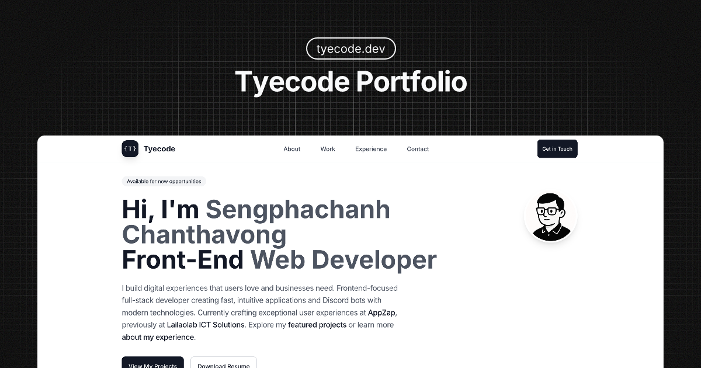

<div align="center">


### Front-End Web Developer Portfolio

<p align="center">
  <em>Modern • Responsive • Performance-Focused</em>
</p>

---



<br />

</div>

<div align="center">

[](https://tyecode.github.io/tyecode-portfolio/)
[](https://github.com/tyecode/tyecode-portfolio)
[](https://reactjs.org/)
[](https://www.typescriptlang.org/)
[](https://tailwindcss.com/)

</div>

> **Modern, responsive portfolio website showcasing front-end web development expertise with React, TypeScript, and Tailwind CSS.**

## 👨‍💻 About This Project

Professional portfolio website for **tyecode**, a front-end web developer specializing in modern JavaScript frameworks and user interface development. Built with performance, accessibility, and SEO optimization in mind.

### 🎯 Key Features

- **🎨 Modern Design**: Clean, professional interface with smooth animations
- **📱 Fully Responsive**: Mobile-first approach optimized for all devices
- **⚡ Server-Side Rendering**: React 19 SSR with Express for optimal performance
- **🔍 SEO Optimized**: Comprehensive meta tags, structured data, and Core Web Vitals optimization
- **♿ Accessible**: WCAG compliant with semantic HTML and keyboard navigation
- **🔧 Type Safe**: Built with TypeScript for robust development
- **📱 PWA Ready**: Web manifest with app shortcuts and icons

## 🛠️ Tech Stack

### Core Technologies

- **React 19.0** - Latest React with concurrent features and Suspense
- **TypeScript 5.7** - Type-safe development with latest features
- **Tailwind CSS 4.1** - Utility-first CSS framework with Vite plugin
- **Vite 6.1** - Fast development and optimized builds

### Backend & Performance

- **Express 5.0** - Fast web framework for SSR
- **React Helmet Async 2.0** - SEO optimization and meta tag management
- **Component Code Splitting** - Optimized loading with React Suspense

### Development Tools

- **PNPM** - Fast, efficient package manager
- **Lighthouse CLI** - Performance and SEO testing
- **Prettier** - Code formatting and consistency

## 🎨 Portfolio Sections

### 🏠 Hero Section

Professional introduction with clear role description, availability status, and call-to-action buttons.

### 👨‍💻 About Section

Skills showcase with interactive cards, professional summary, and development philosophy.

### 💼 Work Section

Featured projects with detailed descriptions, technology tags, and external links.

### 🎯 Experience Section

Professional timeline with key achievements and technology progression.

### 📧 Contact Section

Contact form with validation, multiple contact methods, and social media links.

## 🔍 SEO & Performance

- **📊 Structured Data** (JSON-LD) for rich search result snippets
- **🎯 Dynamic Meta Tags** with Open Graph and Twitter Cards
- **⚡ Core Web Vitals** optimization for search ranking
- **🗺️ XML Sitemap** and robots.txt for search engines
- **♿ Accessibility** features for better UX and SEO

## 🚀 Getting Started

### Development

```bash
# Install dependencies
pnpm install

# Start development server
pnpm run dev

# Visit http://localhost:8000
```

### Build & Preview

```bash
# Build for production (SSR)
pnpm run build
pnpm run preview

# Build for static hosting
pnpm run build:static
pnpm run preview:static
```

### Performance Testing

```bash
# Test development build
pnpm run lighthouse

# Test production build
pnpm run lighthouse:prod
```

## 📊 Performance Metrics

Latest Lighthouse scores:

- **⚡ Performance**: 92/100
- **♿ Accessibility**: 91/100
- **🏆 Best Practices**: 96/100
- **🔍 SEO**: 91/100

## 🚀 Deployment

Deployed on **GitHub Pages** with automated CI/CD:

- **GitHub Actions** workflow for continuous deployment
- **Automatic builds** on push to main branch
- **Performance testing** with Lighthouse CI

## 🤝 Contributing

Contributions are welcome! Please read our [Contributing Guidelines](CONTRIBUTING.md) for:

- Development setup and standards
- Code quality and best practices
- Pull request guidelines

## 📄 License

MIT License - see the [LICENSE](LICENSE) file for details.

---

<div align="center">
  
  
  ⭐ **Star this repository** if you found it helpful!
  
  **Live Demo**: [https://tyecode.github.io/tyecode-portfolio/](https://tyecode.github.io/tyecode-portfolio/)
</div>
